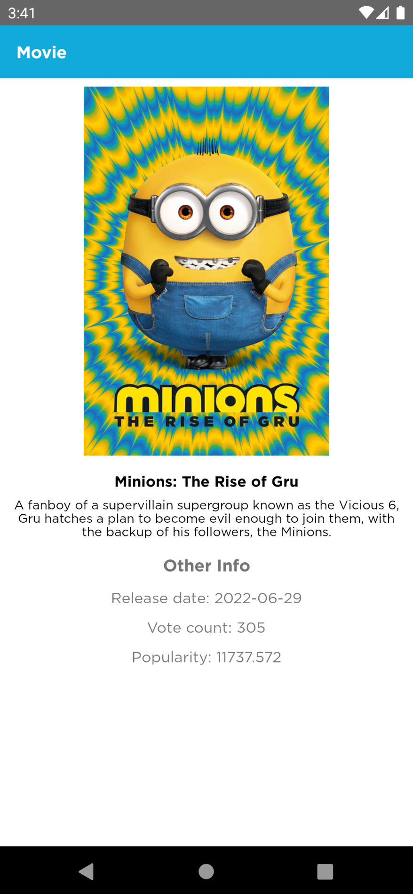
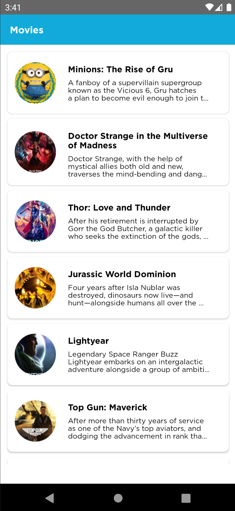

MovieApp
========
Simple app based on [jsonplaceholder](https://www.themoviedb.org/documentation/api) example REST API.

Description.
-----
MovieApp was developed using View Model [MVVM](https://developer.android.com/topic/libraries/architecture/index.html) and Repository Data pattern  
It is build on top of [Dagger 2](https://github.com/google/dagger), [Jetpack (Androidx)](https://developer.android.com/jetpack/) libraries (navigation component, room, etc...), mockk, coroutines and flow.

Architecture
-----
We use simplified version of clean architecture.

The Application is split into a three directories architecture:
- Presentation -> UI, fragments, activities, adapter, custom views, etc.
- Domain -> repository, use cases, models, etc.
- Data -> repository implementation, data local source, data remote source, etc.

The 3 directories architectural approach is majorly guided by clean architecture which provides
a clear separation of concerns with its Abstraction Principle.

Demo
-----
The project is a basic implementation of a movie list. 
  - You can display movies and see the detail of movie. 




Common used libraries :
- [Retrofit](https://github.com/square/retrofit)
- [Mockk](https://mockk.io/)
- [Dagger 2](https://dagger.dev/)
- [Room](https://developer.android.com/training/data-storage/room)

License
-----
 ```
   Copyright 2022 Juan Carlos Granda
   
   Licensed under the Apache License, Version 2.0 (the "License");
   you may not use this file except in compliance with the License.
   You may obtain a copy of the License at

       http://www.apache.org/licenses/LICENSE-2.0

   Unless required by applicable law or agreed to in writing, software
   distributed under the License is distributed on an "AS IS" BASIS,
   WITHOUT WARRANTIES OR CONDITIONS OF ANY KIND, either express or implied.
   See the License for the specific language governing permissions and
   limitations under the License.
 ```
